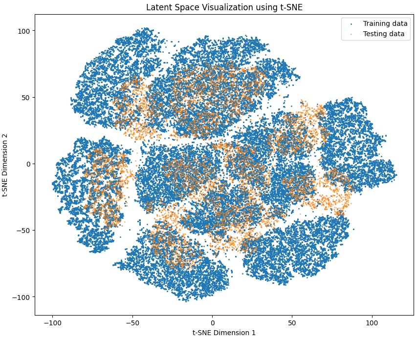

# Visualizing Latent Spaces

<p>
  
</p>

## Project Description

This project is an overview of `Latent Spaces`, an important element in deep learning, machine learning (ML), and artificial intelligence (AI). Latent spaces are also known as latent feature spaces or embedding spaces.

Why are latent spaces such an important concept? The answer is simple. Latent spaces enable learning models to encode, compress, and generate data in a more efficient and meaningful way. Latent spaces represent embeddings of a set of items within a topological space (i.e., manifold) that result in items resembling each other being positioned closer to one another. This positionng is a key concept in embedding text in Large Language Models (LLMs) for instance.

Latent spaces facilitate tasks like anomaly detection, data generation, and feature extraction.

### What this Project Does Specifically

In a Jupyter notebook, I use two methods of latent space generation: Principal Component Analysis (PCA) and t-Distributed Stochastic Neighbor Embedding (t-SNE) to project high dimensional (in this case three dimension) MNIST datasets into a lower two dimensional space for visualization.

#### The PCA Section of the Notebook

Helps in understanding principal components and overall variance in the latent space.

In this section, I visualize the latent space using PCA by following these steps:

- Data Preprocessing: The MNIST dataset is normalized and reshaped. Each image is converted from 28x28 to a 784-dimensional vector, essentially, I normalize the MNIST dataset and flatten the images for the autoencoder.

- Autoencoder Architecture: The autoencoder consists of an encoder that compresses the data into a latent space and a decoder that reconstructs the original data from the latent space.

- Training: I train the autoencoder on the MNIST dataset, which helps the model learn meaningful representations in the latent space.

- Dimensionality Reduction: I use PCA to reduce the latent space dimensions to 2D for visualization.

- Plotting: We use Matplotlib to create scatter plots of the latent space representations, providing a visual understanding of how the model organizes the data.

#### The t-SNE Section of the Notebook

To visualize the latent space using t-SNE, I followed the steps below.

- Data Preprocessing: The MNIST dataset is normalized and reshaped. Each image is converted from 28x28 to a 784-dimensional vector.

- Autoencoder Model: I create an autoencoder with a simple architecture for this example. The encoder compresses the data into the latent space, and the decoder reconstructs the original data.

- Training: The autoencoder is trained to minimize the reconstruction loss, learning to map the data into the latent space effectively.

- Latent Space Representation: After training, I extract the latent space representations using the encoder.

- Dimensionality Reduction with t-SNE: t-SNE is applied to reduce the latent space dimensions to 2D. This technique helps in visualizing how data points are distributed in the latent space and can reveal clusters and structures that are not apparent in higher dimensions.

- Plotting: I use Matplotlib to create scatter plots of the t-SNE reduced latent space. Different colors or markers can be used to distinguish between training and testing data.

---

## Objective

The project uses two techninques to visualize the latent space of the [MNIST](https://en.wikipedia.org/wiki/MNIST_database) dataset of handwritten digits:

- [Principal Component Analysis (PCA)](https://en.wikipedia.org/wiki/Principal_component_analysis)
- [t-Distributed Stochastic Neighbor Embedding(t-SNE)](https://en.wikipedia.org/wiki/T-distributed_stochastic_neighbor_embedding)

The project contains the key elements:

- `Deep Learning` for neural networks building,
- `Git` (version control),
- `Jupyter` python coded notebooks,
- `Keras` to build autoencoder and layers,
- `Matplotlib` visualization of spaces,
- `MNIST` dataset to test visualization,
- `Numpy` for arrays and numerical operations,
- `Python` the standard modules,
- `Scikit-Learn` for PCA and TSNE modules and to get training and test datasets,
- `TensorFlow` to build autoencoder and layers

---

## Tech Stack


---

## Getting Started

Here are some instructions to help you set up this project locally.

---

## Installation Steps

The Python version used for this project is `Python 3.11` to be compatible with TensorFlow.

Follow the requirements for using TensorFlow [here](https://www.tensorflow.org/install/pip#macos)

- Make sure to use python versions `Python 3.9–3.12
- pip version 19.0 or higher for Linux (requires manylinux2014 support) and Windows. pip version 20.3 or higher for macOS.
- Windows Native Requires Microsoft Visual C++ Redistributable for Visual Studio 2015, 2017 and 2019

### Clone the Repo

1. Clone the repo (or download it as a zip file):

   ```bash
   git clone https://github.com/beenlanced/ai_learning_visualizing_latent_spaces.git
   ```

2. Create a virtual environment named `.venv` using `uv` Python version 3.11:

   ```bash
   uv venv --python=3.11
   ```

3. Activate the virtual environment: `.venv`

   On macOs and Linux:

   ```bash
   source .venv/bin/activate #mac
   ```

   On Windows:

   ```bash
    # In cmd.exe
    venv\Scripts\activate.bat
   ```

4. Install packages using `pyproject.toml` or (see special notes section)

   ```bash
   uv pip install -r pyproject.toml
   ```

   or alternatively with the `requirements.txt` file

   ```bash
   uv pip install -r requirements.txt
   ```

### Install the Jupyter Notebook `visualizing_latent_space.ipynb`

1. **Run the Project**

   - Run `visualizing_latent_space.ipynb` in Jupyter Notebook UI or in VS code.

---

## Special Notes

- Including`requirements.txt` file as there are unique considerations when using the `TensorFlow` library. Plus, just in case you run into issues wth the `pyproject.toml` file there is the ability to use the requirements file as well to build the virtual environment.

- Running this notebook took approximately 25 minutes to run using an Apple M4 Pro with macOS Sequoia. Depending on the processor(s) that you are running this time will vary.

---

### Final Words

Thanks for visting.

Give the project a star (⭐) if you liked it or if it was helpful to you!

You've `beenlanced`! 😉

---

## Acknowledgements

I would like to extend my gratitude to all the individuals and organizations who helped in the development and success of this project. Your support, whether through contributions, inspiration, or encouragement, have been invaluable. Thank you.

Specifically, I would like to acknowledge:

- [geeksforgeeks](https://www.geeksforgeeks.org/what-is-latent-space-in-deep-learning/). This project was based off of their code which made it super convenient to test out my code against known results. Kudos and Thanks!

- [Hema Kalyan Murapaka](https://www.linkedin.com/in/hemakalyan) and [Benito Martin](https://martindatasol.com/blog) for sharing their README.md templates upon which I have derieved my README.md.

- The folks at Astral for their UV [documentation](https://docs.astral.sh/uv/)

---

## License

This project is licensed under the MIT License - see the [LICENSE](./LICENSE) file for details
